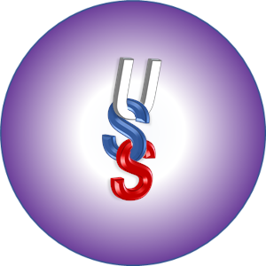

# Markdown Cheat Sheet

# Table of Contents
* [Markdown Cheat Sheet](#Markdown-Cheat-Sheet)
* [Table of Contents](#Table-of-Contents)
* [Headings](#Headings)
* [Text Styling](#Text-Styling)
* [Lists](#Lists)
* [Links](#Links)
* [Images](#Images)
* [Coding & Syntax](#Coding=&-Syntax)
* [Tables](#Tables)

# Headings
# Heading 1 = `#`
## Heading 2 = `##`
### Heading 3...6 = `###...######`

# Text Styling
**Bold Text** = `**Text** or __Text__`  
*Italic Text* = `*Text* or _Text_`  
**_Bold & Italic Text_** = `**_Text_** or __*Text*__`  
~~Strike Through Text~~ = `~~Text~~`  
New Line/Line Break = `  `(two spaces at end of line)

# Lists
1. Ordered = `1. First Item`
2. List = `2. Second Item`
3. Here = `3. Third Item`

* Unordered = `* Item` or `- Item` or `+ Item`
* List = `* Item`
* Here = `* Item`

    Non-bulleted non-numbered but still indented. = `   ` (three spaces) or `   ` (tab)

# Links
[I am a link](https://www.github.com) = `[Display Text](link-url)`  
[I am a link with hover tag](https://www.github.com "Checkout GitHub") = `[Display Text](link-url "Hover Text")`  
[I am a link to heading in this document](#Markdown-Cheat-Sheet) = `[Display Text](#Heading-Replacing-Any-Spaces-With-Dashes)`  
https://www.github.com or <https://www.github.com> = `https://plain-url.com` or `<https://plain-url-in-angle-brackets.com>`  
[I am a link using variable as target][my target link] = `[Display Text][case InsEnsitiVe variable]`  
Then later in file you would define variable like = `[case Insensitive variable]: target-url "Hover Text"` (with empty line before)

[my target link]: https://www.github.com "GitHub Again"

# Images
 = ``  
Can use variable links as shown in [Link Section Above](#Links).

# Coding & Syntax
Inline `Code block area` = `` Outside code block area `Code block area` `` (using 1 back-tick to start and end in-line code block)  

Multi-line language specific code block (using 3 back-ticks to start then programming language and end with 3 back-ticks)  
> \```java  
> language code goes here   
> \```  
```java

String myString = "code block area";
boolean stillInCodeBlock = true;
if(stillInCodeBlock){
    System.out.println(myString);
}

```
```javascript

var myJavaScript = "code block here";
if (myJavaScript !== null){
    console.log(myJavaScript);
}
```

# Tables


>Block Quote = `>Text`